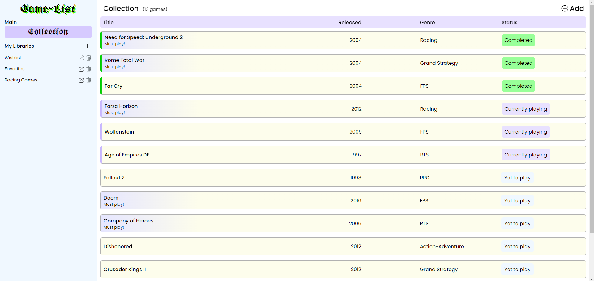
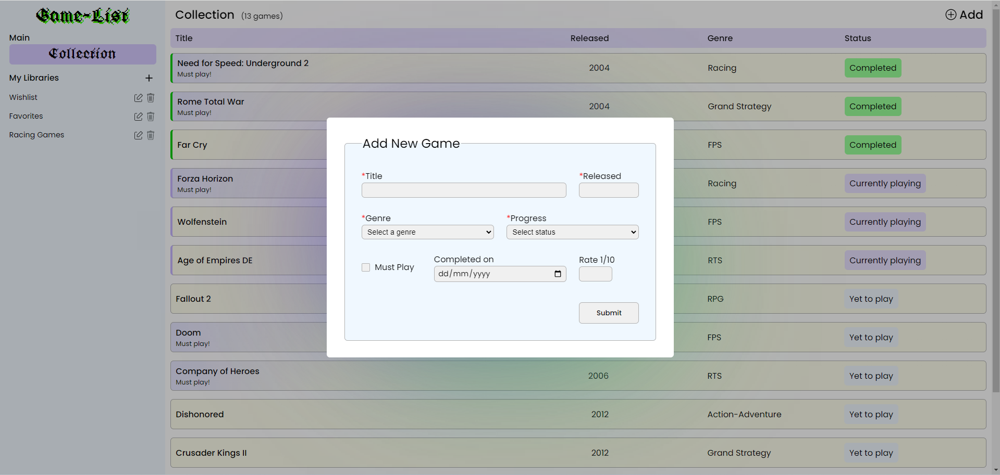

# Game-List

This is a Game-List project that aims to create a game library app which stores all your favorite games.

No more excel sheets! Add, rename and delete custom libraries. Store, edit and delete games inside them. Set different game statuses - track completed games, ones you're currently playing and the ones in your backlog. Mark them as a 'Must Play!' and rate them once you're done.

This was done as a twist on the ToDo List project as part of The Odin Project curriculum.

### <a href="https://dimitrije108.github.io/game-list/">LIVE VERSION</a>

## Implementation

* Took care to follow OOP SOLID Principles, adhere to loose coupling and mind the Separation of Concern;
* Used the MVC pattern for the first time to keep the logic and the view separate;

---------------------------------------------------------------------------------------------------------------

